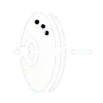

# Hi-hat Slideshow Video Generator

<div align="center">



A professional portfolio video slideshow application built with React, TypeScript, and Remotion. Create stunning video presentations from images with customizable transitions, captions, music, and export options.

[](https://opensource.org/licenses/MIT)
[](https://www.typescriptlang.org/)
[](https://reactjs.org/)
[](https://vitejs.dev/)

**Brought to you by [Hi-hat Consulting](https://hi-hat.consulting)**

</div>

## ✨ Features

- **🖼️ Image Upload**: Drag-and-drop interface for easy image uploads (PNG, JPG, WEBP)
- **📊 Slide Management**: Reorder slides, adjust durations (1-10 seconds)
- **🎬 Transitions**: 6 transition types with customizable duration (0.5-2 seconds)
  - Fade
  - Slide
  - Zoom
  - Flip
  - Blur
  - Scale
- **📝 Captions**: Add text overlays to each slide
- **🎵 Music**: Upload background audio for your slideshow (MP3, WAV, OGG)
- **📐 Aspect Ratios**: Support for 16:9, 9:16, and 1:1 formats
- **📹 Export**: Multiple resolution options (720p, 1080p, 4K) in MP4 format
- **👀 Live Preview**: Real-time preview of your slideshow composition
- **🎨 Modern UI**: Dark theme with responsive design

## 🛠️ Tech Stack

- **React 19.2** - UI framework
- **TypeScript 5.9** - Type safety
- **Vite 8.0** - Build tool and dev server
- **Remotion 4.0** - Video rendering engine
- **Zustand 5.0** - State management
- **Tailwind CSS 3.4** - Styling
- **Framer Motion 12.38** - Animations
- **Lucide React 1.7** - Icons
- **Vitest 4.1** - Unit testing

## 📋 Prerequisites

- **Node.js** 18+
- **npm** 9+ or **yarn**

## 🚀 Quick Start

### Clone the repository

```bash
git clone https://github.com/your-username/hi-hat-slideshow.git
cd hi-hat-slideshow
```

### Installation

```bash
npm install
```

### Development Server

Start the development server with hot module replacement:

```bash
npm run dev
```

The app will be available at **http://localhost:5173**

The terminal will show:

```
  VITE v8.0.x  ready in 123 ms

  ➜  Local:   http://localhost:5173/
  ➜  press h + enter to show help
```

## 🧪 Testing

Run the comprehensive test suite:

```bash
npm run test
```

To run tests in watch mode (re-run on file changes):

```bash
npm run test -- --watch
```

To run a specific test file:

```bash
npm run test -- src/utils/transitions.test.ts --run
```

**Current Test Coverage:**

- 87 tests passing
- 1 test skipped (browser API limitation)
- Covers: frame calculations, export settings, file validation, state management

## 🏗️ Building for Production

Create an optimized production build:

```bash
npm run build
```

Output will be in the `dist/` directory, ready for deployment.

### Preview Production Build

Test the production build locally:

```bash
npm run preview
```

## 📁 Project Structure

```
src/
├── components/          # React components
│   ├── UploadZone/      # Image upload interface
│   ├── Timeline/        # Slide timeline and controls
│   ├── Transitions/     # Transition components
│   ├── VideoPreview.tsx # Video preview component
│   ├── ExportControls.tsx # Export settings and button
│   ├── AspectRatioSelector.tsx # Aspect ratio selection
│   ├── AudioUpload.tsx  # Audio upload component
│   └── Comment.tsx      # Development comments
├── remotion/            # Remotion video composition
│   ├── Root.tsx         # Main video composition
│   └── index.ts         # Remotion exports
├── hooks/               # Custom React hooks
├── assets/              # Static assets (images, logos)
├── App.tsx              # Main app component
├── main.tsx             # App entry point
├── App.css              # App styles
└── index.css            # Global styles
```

## 📖 How to Use

1. **📤 Upload Images**: Drag images into the upload area or click to select files (PNG, JPG, WEBP)
2. **🔄 Organize Slides**: Drag to reorder slides in the timeline
3. **⚙️ Configure Slides**:
   - Adjust slide duration (1-10 seconds)
   - Adjust transition duration (0.5-2 seconds)
   - Add captions and select transition type
4. **🎵 Add Audio**: Upload an MP3, WAV, or OGG file as background music
5. **👀 Preview**: Click "Preview Slideshow" to see the composition
6. **📐 Set Aspect Ratio**: Choose 16:9, 9:16, or 1:1 format
7. **📹 Export**: Select resolution and click "Export Slideshow" to generate video

## 📜 Available Scripts

| Command           | Purpose                                |
| ----------------- | -------------------------------------- |
| `npm run dev`     | Start development server               |
| `npm run build`   | Create production build                |
| `npm run preview` | Preview production build locally       |
| `npm run test`    | Run test suite                         |
| `npm run lint`    | Check code for errors and style issues |

## 🌐 Browser Support

- Chrome 90+
- Firefox 88+
- Safari 15+
- Edge 90+

## 🔧 Troubleshooting

**Port 5173 already in use?**

```bash
# Kill the process using the port (macOS/Linux)
lsof -ti:5173 | xargs kill -9

# Or specify a different port
npm run dev -- --port 3000
```

**Dependencies not installing?**

```bash
# Clear npm cache and reinstall
npm cache clean --force
rm -rf node_modules package-lock.json
npm install
```

**Tests failing?**

```bash
# Make sure you're using the correct Node version
node --version  # Should be 18+

# Clear test cache and rerun
npm run test -- --clearCache
```

## 🚀 Deployment

### Build for Production

```bash
npm run build
```

The built files will be in the `dist/` directory, ready for deployment to any static hosting service.

### Deploy to Vercel

```bash
npm install -g vercel
vercel --prod
```

### Deploy to Netlify

```bash
# Build the project
npm run build

# Deploy the dist folder to Netlify
```

## 🤝 Contributing

Contributions are welcome! Please feel free to submit a Pull Request. For major changes, please open an issue first to discuss what you would like to change.

1. Fork the repository
2. Create your feature branch (`git checkout -b feature/AmazingFeature`)
3. Commit your changes (`git commit -m 'Add some AmazingFeature'`)
4. Push to the branch (`git push origin feature/AmazingFeature`)
5. Open a Pull Request

## 📝 License

This project is licensed under the MIT License - see the [LICENSE](LICENSE) file for details.

## 🙏 Acknowledgments

- [Remotion](https://www.remotion.dev/) for the amazing video rendering library
- [React](https://reactjs.org/) for the UI framework
- [Tailwind CSS](https://tailwindcss.com/) for the utility-first CSS framework
- [Vite](https://vitejs.dev/) for the blazing-fast build tool

## 📞 Contact

**Brought to you by [Hi-hat Consulting](https://hi-hat.consulting)**

- Website: [www.hi-hat.consulting](https://www.hi-hat.consulting)
- Email: info@hi-hat.consulting

---

<div align="center">

**⭐ Star this repository if it helped you!**

Made with ❤️ by [Hi-hat Consulting](https://hi-hat.consulting)

</div>
